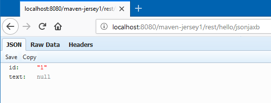

# Jersey Null Value Issue

A test case for observing an empty value that gets marshaled as a `null`; first observed upon switching to JDK 1.8.0_161.

```bash
root@292c522d413f:/usr/local/tomcat# java -version
java version "1.8.0_161"
Java(TM) SE Runtime Environment (build 1.8.0_161-b12)
Java HotSpot(TM) 64-Bit Server VM (build 25.161-b12, mixed mode)
```

## Getting Started

The following POM snippet shows the Jersey dependencies.

```xml
<properties>
	<project.build.sourceEncoding>UTF-8</project.build.sourceEncoding>
	<jersey.version>1.19.4</jersey.version>
</properties>

<dependencies>
	<dependency>
		<groupId>com.sun.jersey</groupId>
		<artifactId>jersey-bundle</artifactId>
		<version>${jersey.version}</version>
	</dependency>
	<dependency>
		<groupId>com.sun.jersey</groupId>
		<artifactId>jersey-server</artifactId>
		<version>${jersey.version}</version>
	</dependency>
</dependencies>
```

Our intention is to create an empty string value: `""` with the expectation that is what we will receive.

```java
@Path("/hello")
public class MyResource {
	
	@GET
	@Produces(MediaType.APPLICATION_JSON)
	@Path("/jsonjaxb")
	public Response toJettisonJaxb() {
		XmlPojo pojo = new XmlPojo(1, "");
		return Response.ok().entity(pojo).build();		
	}
}
```

Instead, the empty value is marshaled to `JSON` as a `null` value.



## Docker

This project includes a `docker` image that can be used for testing. After starting up docker, browse to:

http://localhost:8080/jerseynullvalue-0.0.1/rest/hello/jsonjaxb

The structure of the docker image is as follows.

```bash
JDK8 >> Tomcat 8 >> Jersey 
```

The Jersey image is built upon the Tomcat image which is build upon the Oracle JDK8 image.

```bash
$ docker-compose up -d
```

If you need to change the underlying images, use the `--build` switch, e.g.

```bash
$ docker-compose up -d --build
```
